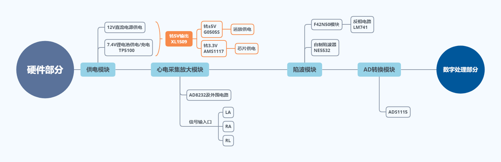
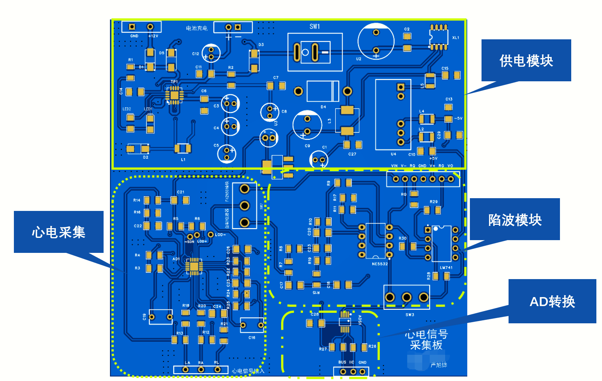
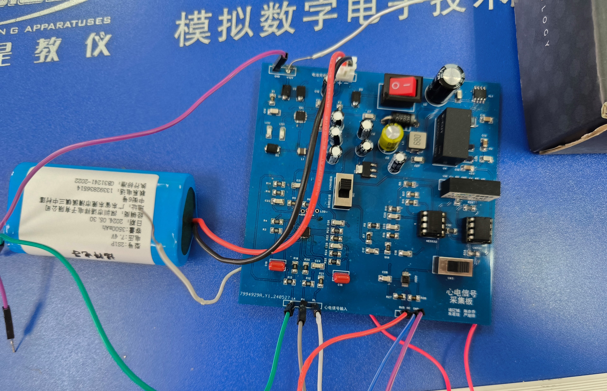
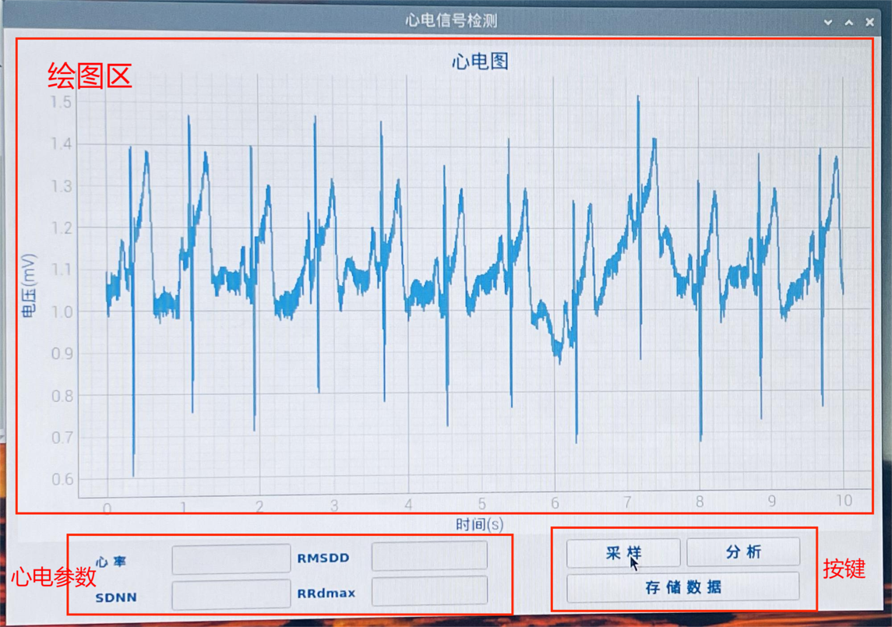

# 可充电便携式心电监测设备

**项目时间：** 2024.05  
**项目性质：** 信号分析与处理课程大作业  
**担任角色：** 项目组长  
**项目贡献：** 负责硬件部分设计，包括PCB设计与焊接、器件选型、电路调试

### 🌟 项目背景与简介
本实验旨在利用树莓派+PCB的系统实现心电信号的采样与分析。实验过程中，PCB上以AD8232芯片为核心的心电采样电路通过三导联采集将心电信号采集作为模拟量输入，随后经过工频陷波器进行滤波，输入ADS1115模数转换芯片进行模数转换，经IIC输入树莓派中。

在树莓派平台上，本实验借助python编程环境及其各个库，实现了心电信号的分析预处理，最终得出QRS波群位置并计算时域HRV参数。在展示界面方面，实验通过PYQT前端，将分析结果进行波形和数据展示，同时保存到MariaDB数据库中。

### 💻 核心技术与工具
- **硬件设计**：嘉立创 EDA、双层 PCB 设计与手工焊接
- **算法实现**：QRS 波形检测算法

### 📐 系统架构与硬件方案

### 📷 **实物图/成果图展示**  
- **实物展示**

- **效果图展示**

### 🏆 难点攻克与最终成果
团队 4 人协作，提前一周顺利高质量交付成品，全组取得**满分成绩**。成功实现了设备的**小型化**与**便携充电**功能，QRS 波形检测稳定可靠。
