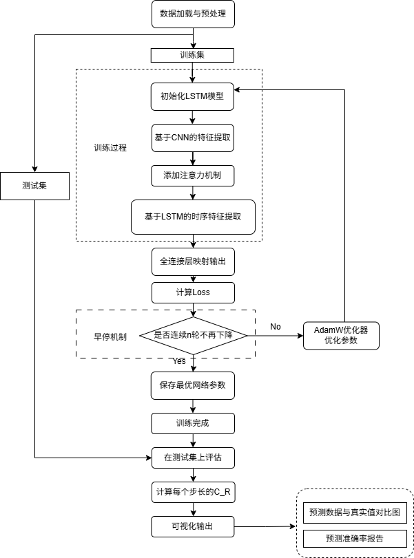
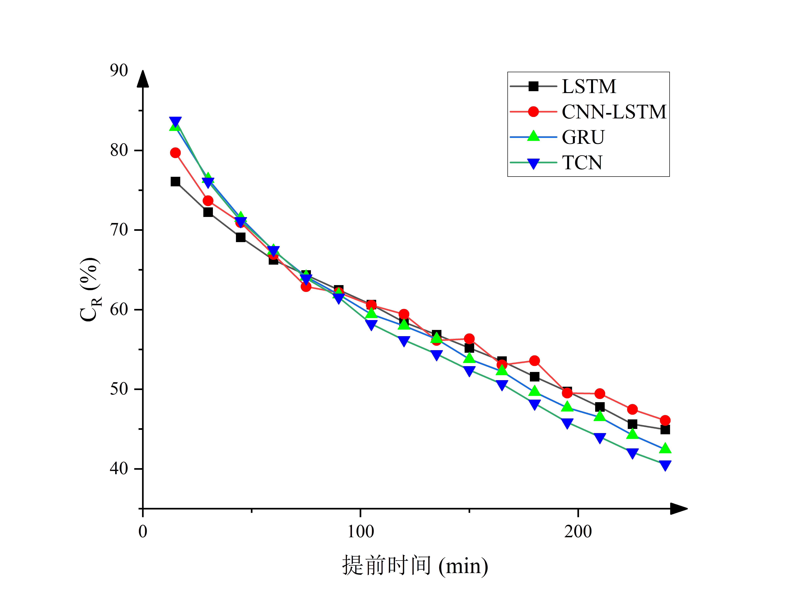
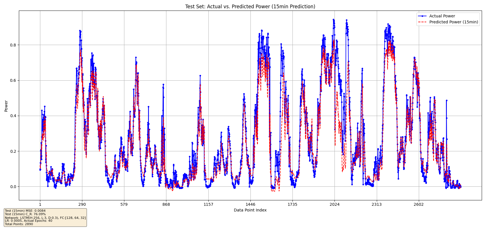
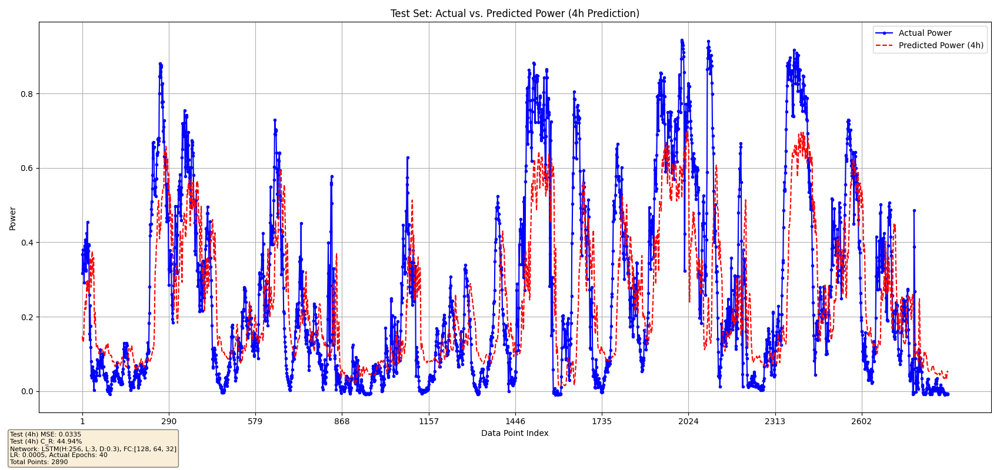

# 风电功率超短期多步时序预测

**项目时间：** 2025.05  
**项目性质：** 人工智能与电力大数据课程大作业  
**担任角色：** 核心算法负责人  

### 🌟 项目背景与简介
本项目实现了基于深度学习的风电功率多步长预测系统，包含五种不同的神经网络架构：GRU、LSTM、LSTM-CPU优化版、TCN和CNN-LSTM混合模型。系统能够预测未来4小时（16个15分钟时间步）的风电功率输出，为风电场运营和电网调度提供技术支持。

其中，评估指标为授课教师提供的“准确率$C_R$”，该指标能够更贴合实际地评估风电的预测效果。其表达式如下：

$$
C_R = \left( 1 - \sqrt{\frac{1}{N} \sum_{i=1}^{N} (R_i)^2} \right) \times 100\%
$$

$$
R_i = 
\begin{cases} 
\frac{P_{M,i} - P_{P,i}}{P_{M,i}} & P_{M,i} > 0.2 \\
\frac{P_{M,i} - P_{P,i}}{0.2} & P_{M,i} \leq 0.2 
\end{cases}
$$

其中，$C_R$为功率预测准确率，$P_{M,i}$为$i$时刻的实际风电功率，$P_{P,i}$为$i$时刻的预测风电功率，$N$为预测时间步数。

### 💻 核心技术与工具
- **编程语言与框架**：Python，使用Pytorch
- **核心模型**：BP、LSTM、GRU、TCN 神经网络及其对比分析

### 📐 算法设计与实验过程

### 📷 **预测结果图展示**  
- 实际效果预测曲线

- LSTM 15min预测效果

- LSTM 4h预测效果

### 🏆 难点攻克与最终成果
实现了对未来 4 小时多步时序预测。15分钟 MSE < 0.01，4小时 MSE < 0.03，模型泛化能力与预测精度达到领先水平。
