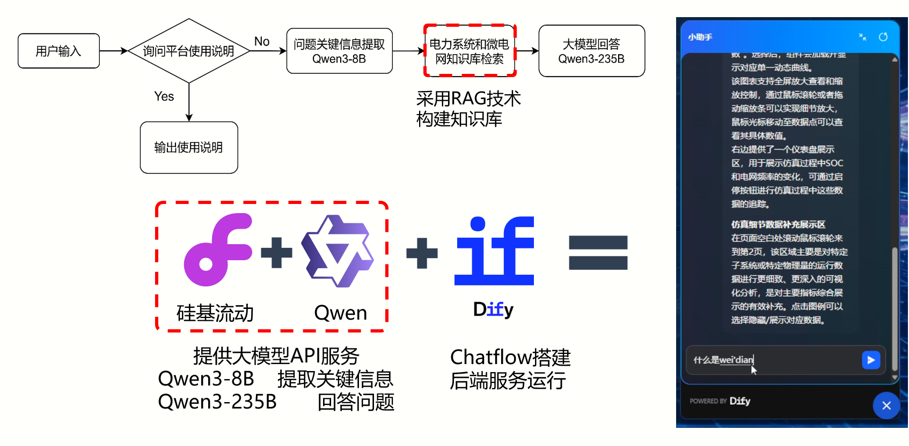
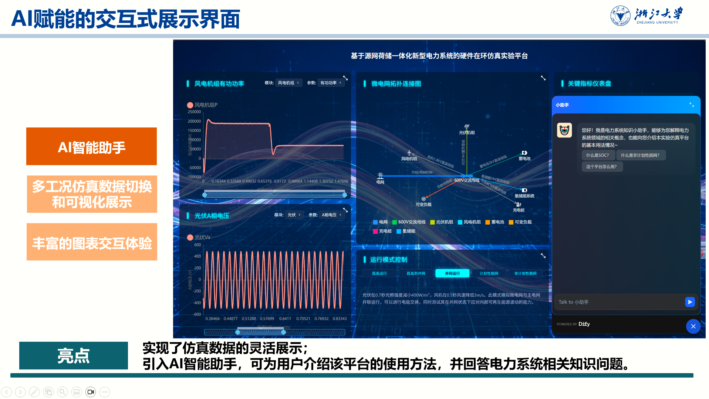
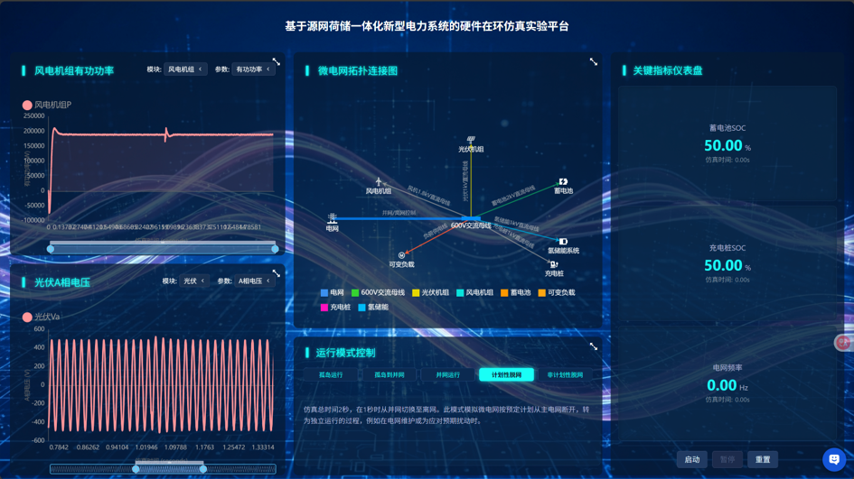

# 基于源网荷储一体化新型电力系统的硬件在环仿真实验平台

**项目时间：** 2025.01 - 2025.07  
**项目性质：** 高校电气电子工程创新大赛复赛项目  
**担任角色：** 前端开发与 AI 交互设计负责人  

### 🌟 项目背景与简介
本前端展示模块是“基于源网荷储一体化的可视化仿真平台”的用户交互核心与数据展示窗口。其主要功能是将复杂的微电网仿真数据以直观、易懂、可交互的方式呈现给用户，从而辅助用户理解系统在不同预设工况下的运行特性、关键性能指标以及各设备单元的动态响应。

### 💻 核心技术与工具
- **前端页面**：Vue3 生态组件
- **AI 与效率工具**：Cursor、RooCode 辅助全代码开发
- **智能化工作流**：基于 Dify 工作流自建 RAG（检索增强生成）知识库

### 📐 系统架构与详细实现
*（可在此处添加系统整体前后端架构图、RAG 知识库检索架构图、或者 Dify 节点连线控制流图）*

### 📷 **前端网页演示截图**  
- *网页系统的截图* 

- *AI助手界面展示* 

### 🏆 难点攻克与最终成果
独立从零构建了整个前端展示页面数据看板，并将定制后的智能问答功能成功嵌入平台系统，充分优化了设备仿真过程中的人机协同交互体验。
