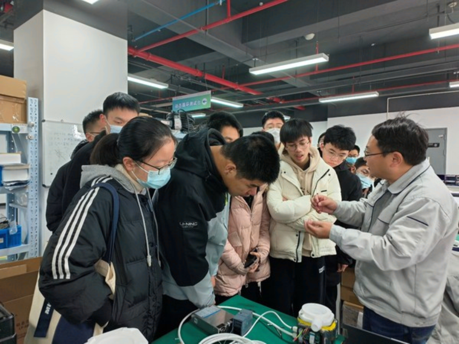
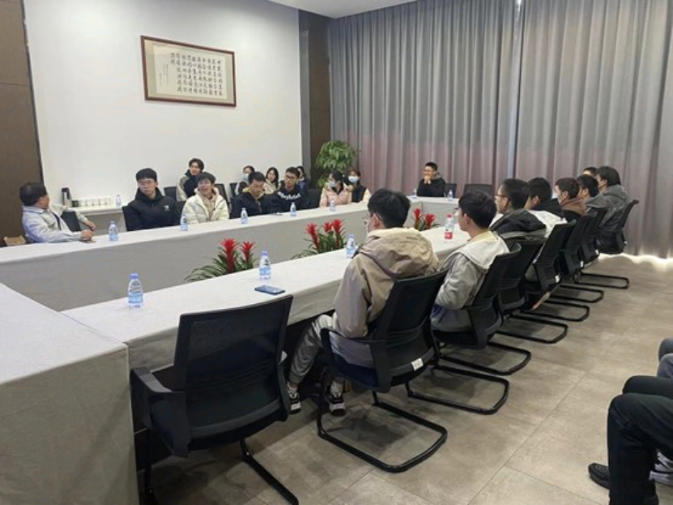
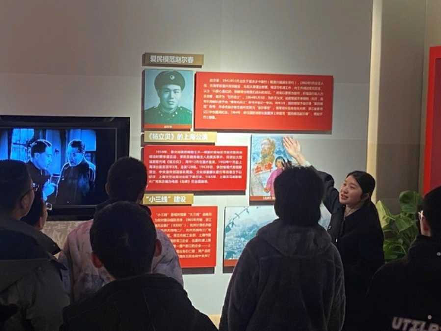
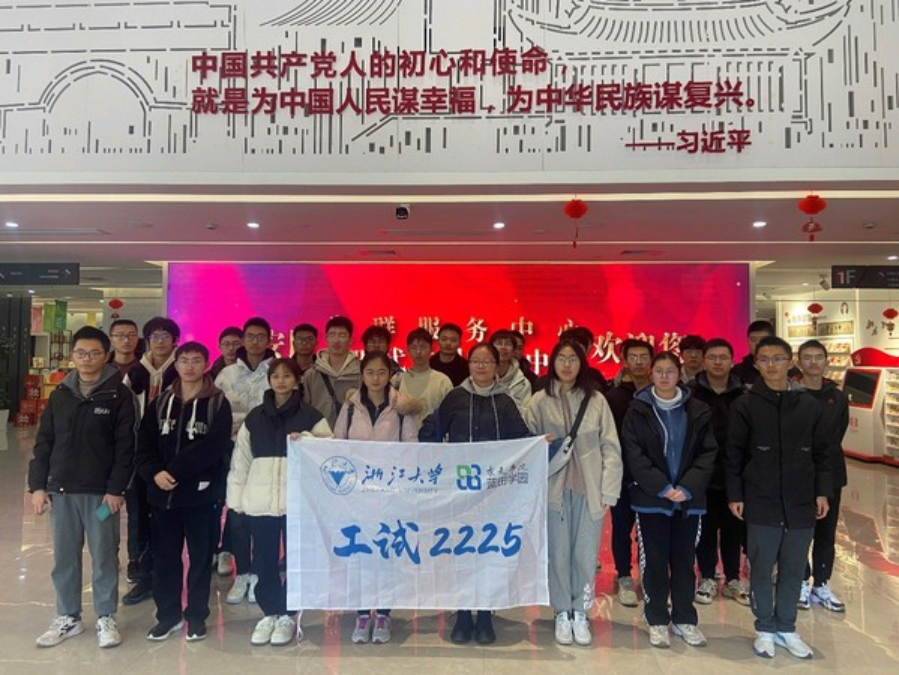

# 学生工作经历

欢迎来到学生工作详情页。这里包含了我在校期间担任各项职务的具体工作内容、心得体会以及组织的大型活动展示。

---

## 班级管理与组织

**担任职务：** 班长  
**任职时间：** 2022.09 - 2023.09  
**考评结果：** 优秀，获评2022-2023学年校级优秀团干部

### 🎯 大型活动组织：高新技术企业及党群服务中心参观
- **活动规模**：两个班级共计 40 余人
- **活动内容**：从紫金港校区出发，上午参观临安区浙大校友高新技术企业，下午参观临安区党群服务中心
- **主要职责**：作为总负责人，全权负责前期策划、路线勘察、车辆接送协调以及现场的安全与纪律保障。
- **难点攻克**：在活动筹备与执行期间，妥善处理了受外部形势影响下的突发状况，例如场地临时协调、出行安全预案等，最终保障了活动的圆满落实。

### 📷 **活动合影/现场照片（占位）**  
- **参观临安区高新技术企业**

- **参观临安区党群服务中心**

---

## 学生会职务与志愿服务

**担任职务：** 办公室干事  
**任职机构：** 在校学生会办公室部门  
**任职时间：** 任职一年  

### 🎯 大型校级活动后勤保障
- **集体祭扫活动**：参与前期的物资采购、现场的流程引导与秩序维护。
- **校学生节**：协助部门完成物资的大型统筹、各部门之间的协调沟通，保障晚会/活动的顺利推进。

